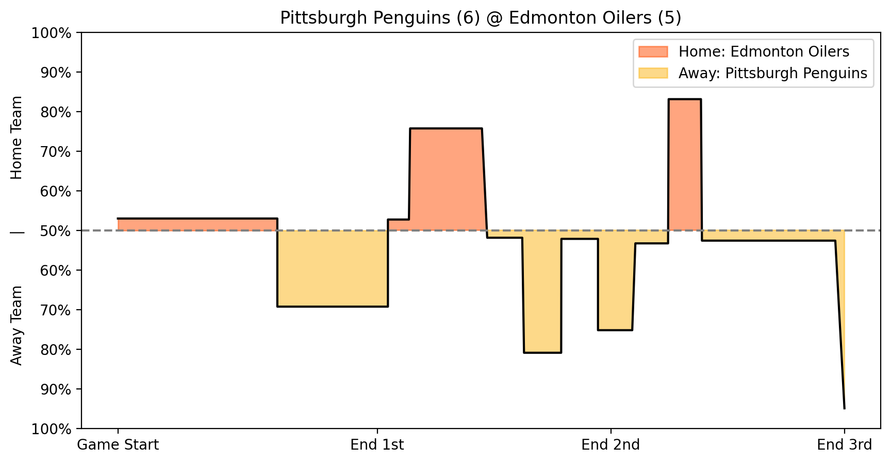
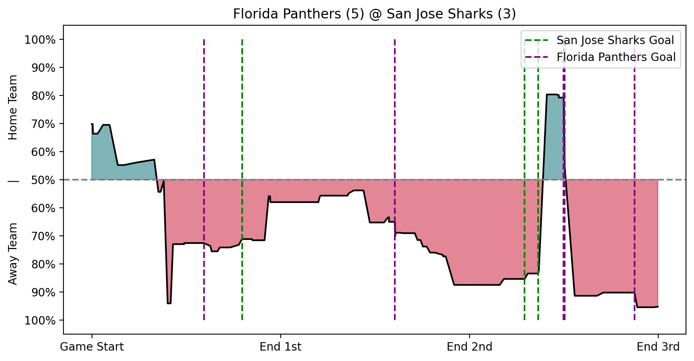

# Puck Predictions: Unraveling the NHL Game Forecasting Riddle

**Authors:** Jeff Hansen, Benjamin McMullin, Dylan Skinner, Jason Vasquez

The goal of this project is simple: predict the outcomes of NHL games from any given state during the game. To solve this problem we use three primary methods: Bayesian Network to train a DAG, XGBoost on game states, and an MCMC game simulator. We use each of these methods to generate win probabilities for each time step throughout various NHL games, thus emulating a live win probability. Finally, we analyze the accuracy of these three methods and considered ethical implications of our results.

## Problem Statement and Motivation

In the world of sports analytics, predicting the outcomes of games is a common and challenging problem, with live win predictions adding
an extra layer of complexity. For most sports, there are a plethora of widely accepted—yet hidden—predictive models and methods that are used to
predict games. In addition to this, most sports have easily accessible statistics and graphics that give current win probabilities for any live game.

Hockey; however, is a different story. While there are some methods used to predict the outcome of National Hockey League (NHL) games, these models
typically belong to sport books and their nuances are not publicly disclosed. Additionally, hockey analytics is not as
developed as it is in other sports, such as basketball or baseball <a href='#1'>[1]</a>. This lack of model transparency and public interest in hockey analytics
makes predicting the outcomes of NHL games a very underdeveloped and challenging problem. Previous attempts and research into predicting NHL games
has relied on methods such as decision trees and artificial neural networks <a href='#5'>[5]</a> (from 2014), naïve bayes and support vector machines <a href='#6'>[6]</a> (from 2013),
and Monte Carlo simulations <a href='#7'>[7]</a> (from 2014).

In addition to model research, some effort has also gone into developing new features that can be used to better predict the game outcomes. 
The two biggest engineered classes of features are the Corsi
 and Fenwick[^1] metrics (both around 2007); however, we do not use these
 in our approach because future research shows they do not improve model performance <a href='#4'>[4]</a>.

[^1]: These metrics were created by sports bloggers Tim Barnes and Mark Fenwick, respectively. 
 We were unable to locate the original blog posts talking about these metrics, but a good article to learn more about the math can be
 found here https://thehockeywriters.com/corsi-fenwick-stats-what-are-they/.

Our project seeks a similar outcome to the research mentioned above: predict the outcomes of NHL games. Not only this,
but we seek to provide live, accurate, win probabilities for any given game state. Despite the simplicity of the problem statement, 
the solution is not so straightforward. The NHL provides fast-paced games with many events
occuring in quick succession. Our goal is to use this abundance of data and new approaches to build upon previous research.

Our motivation for this project exists strictly as fans of the sport and as data scientists. Our model is not intended to be used for gambling or any other
nefarious purposes—any use of this model for such purposes is a misuse of our work.

## Data

Our data came from the hockeyR Github repository <a href='#3'>[3]</a>. This repository contains an abundance of data about every NHL game
that has occured since the 2010-11 season. This data includes information about the events that transpire in a game (hits, shots, goals, etc.),
which teams are playing, who is on the ice, and the final score of the game. The data is stored in a series of `.csv.gz` files, allowing for
easy access and manipulation.

Each game in a season is given a unique identifier (`game_id`), which is constant across all events in a game. Every event that occurs in a game
will be stored in the `event_type` column. There are 17 unique event types, including game start, faceoff, shot, hit, and goal.
Most of these event types are not relevant to our analysis, so we remove them from the dataset. After removing the unnecessary events, we are left with
nine: blocked shot, faceoff, giveaway, goal, hit, missed shot, penalty, shot, and takeaway. These events are attributed to the
team and player that perform the event. We only take into consideration the team that performs the event and discard the player information to reduce noise and to avoid many one-hot encoded columns.

The data also contains information about when the event occured. This appears in a variaty of formats, but we only
use the `game_time_remaining` column. `game_time_remaining` starts
at 3600 (60 minutes) and counts down to 0. If the game goes into extra time, i.e., it is tied after 60 minutes, `game_time_remaining` will
be a negative value.

We found that our data did not contain any missing values that were not easily explainable. For example, if a game is starting, there will be no
events for penalties, which will result in a `NaN` value in the penalties column. Additionally, any data that was confusing or not easily explainable
(for example the home team having 7 players on the ice and the away team having 5), was manually verified by watching a clip of the game where
the event occured to make sure the event was recorded correctly. We did not find any incorrectly recorded events, so we 
did not remove any strange events from out dataset.

The models were each trained on the 2021-2023 seasons (totaling two seasons), and tested on the most recent 2023-2024 season. This split was chosen because in practice our model would have access to historical data but not have access to the current season's data as it happens.

## Methods

### Bayesian Network

We first used a Bayesian network to establish a benchmark for probability using several key features.

Bayesian networks are probabilistic graphical models that represent probabilistic relationships among a set of variables using a directed acyclic graph (DAG). 
In a Bayesian network, nodes represent random variables, and directed edges between nodes represent probabilistic dependencies between the variables. Each node in the graph is associated with a conditional probability distribution that quantifies the probability of that variable given its parent variables in the graph.

For our purposes, we predefined the structure of the network, and used the data to calculate the conditional probabilities for each node. We then used the network to calculate the probability of a team winning given the current state of the game.

The computational complexity of Bayesian Network inference is high, with exact inference being an NP-hard problem <a href='#2'>[2]</a>. 
Using the python package `pgmpy`, we originally tried to fit a network with all 26 of our features, but our computational resources failed to fit this network.
Then, to get a baseline for our future predictions, we simply fitted the model with the base features of time remaining (tr), home goals (hg), away goals (ag), home shots (hs), away shots (as), home blocked shots (hbs), and away blocked shots (abs) in order to predict wins (w). 
These features were chosen as priors because of our opinion that they are the most important to the game, based upon our knowledge of hockey.

The conditional dependencies of the chosen network are shown in the DAG below:

This model was chosen for the task because different stats in hockey are conditionally dependent of each other, so by modeling those conditional
dependencies and feeding them into the model, we can hopefully acheive a more accurate prediction of the outcome of the game.

### XGBoost

In our NHL analysis research, we partitioned the dataset into segments 
corresponding to individual teams' games over multiple seasons. 
This enabled the creation of time series data in the form of a state vector, capturing the 
play-by-play dynamics of each team's matches. We then trained 
separate XGBoost models for each team to learn their unique patterns 
and strategies. We chose to create an XGBoost model for each team
because we felt it would be more accurate than a single model for all teams.
This is because some teams do very well and some teams do very poorly, and
we felt this difference necessitated a model for each team.

XGBoost was chosen because of its ability to handle large datasets and model complex relationships between features. 
XGBoost is able to attain a high degree of accuracy with a relatively small training time or overhead and was an ideal choice for our research.

### MCMC Game Simulation

To simulate hockey games, we created a Markov Chain where the states are a tuple of three consecutive
events that occurred. For example, if the home team won a faceoff, lost the puck, and 
then the away team shot the puck and missed, the next potential event in the Markov chain would look like table below

  <table> 
    <tr>
      <th>Next Event</th>
      <th>Transition Probability</th>
    </tr>
    <tr>
      <td>Shot Away</td>
      <td>0.1853207</td>
    </tr>
    <tr>
      <td>Blocked Shot Away</td>
      <td>0.1138666</td>
    </tr>
    <tr>
      <td>...</td>
      <td>...</td>
    </tr>
    <tr>
      <td>Penalty Away</td>
      <td>0.0167210</td>
    </tr>
    <tr>
      <td>Goal Home</td>
      <td>0.0085793</td>
    </tr>
  </table>

The probabilities of transitioning from one triple-state to another triple-state is calculated by:

$$
\begin{aligned}
    P(s_{t+1} = (B,C,D) \;|\; s_t = (A,B,C)) &= P(D \;|\; (A,B,C)) \\
    &= \frac{\{ \text{\# of times (A,B,C,D) happend}\}}{\{ \text{\# of times (A,B,C) happened}\}} \\
\end{aligned}
$$

Where $A,B,C,D$ represent events that can occur in a game, and the tuple $(A,B,C,D)$ represents that "$A$ then 
$B$ then $C$ then $D$" happened right after each other in a game.

To simulate a game, we performed a Monte Carlo algorithm (see the algorithm in Appendix <a href='#A'>A</a>)
that acts as a random walk through the Markov chain (note that the `KDE_times()` is a KDE model fit on the amount of seconds that transpired between 
each hockey event for all NHL games over the course of 13 years).

To predict a team's winning probability, we would simulate 50 hockey games with the initial starting states 
$(s_0, s_1, s_2)$ set to the most recent events in the hockey game. By looking at each games
final event counts we compute the winner. We then compute the 
probability as $P(\text{home winning}) = \{\text{number home simulation wins}\}/50$ and 
$P(\text{away winning}) = 1-P(\text{home winning})$.

## Results and Analysis

### Bayesian Network

Overall, the Bayesian network performed well and was able to produce realistic win probabilities. Because it defined a joint distribution using a DAG and
then used that distribution to fit the data, it was able to correctly predict accuracies using the few features provided. However, the Bayesian network struggled to capture the intricate dependencies
of factors other than goals that could affect the win probabilities, so the predicted probabilities are little more than an over all probability calculation of goals and time reamining given historical data.
We see this in the probability graph in the figure below, where the changes in probability correspond to the goals scored in the game. 

Win probability graph using the Bayesian Network. As seen above, the win probability stayed rather stagnant until a goal was scored, where the probability shifted.

### XGBoost

For XGBoost, we leveraged the `.predict_proba()` method to predict win probabilities after the model was fit on the data.
Using this method, we generated 
probabilistic predictions at various stages of a game, allowing us to 
plot the evolving probability of each team winning throughout the match
(see the figure below). 
This approach allowed for more insights into momentum shifts (when one team 
has an advantage due to them having more players on the ice due to 
a penalty by the opposing team), and key moments (such as goals and 
penalties, and critical plays influencing game outcomes) than the Bayesian network, resulting in more variance in the win probability graph.

We can see a high variance of win probability during this game. It is interesting to
    see how a goal being scored impacts the win probability. It is also interesting to see how
    the probability shifts without a goal being scored, implying the other events in the game
    are important to the win probability.

### MCMC Simulator

To evaluate our simulation's effectiveness at accurately modeling actual hockey 
games, we combined a dataset with the final event counts for 1500 actual hockey 
games and for 1500 simulated games. We then performed two experiments. First, We 
trained a KMeans, Logistic Regression, RandomForest and XGBoost model on this 
dataset with default parameters, to see 
if they could classify games as simulated or real. With a 70-30 train-test split, 
the accuracies on the test set were $47.9\%$, $48.5\%$, $67.5\%$ and $69.3\%$ respectively. 
Second, we fit and transformed this dataset using PCA, t-SNE and UMAP 
dimensionality reductions using various perplexity and neighbor hyperparameters to see 
if these algorithms clustered the synthetic games and actual games in 
different clusters. As shown in the figure below, the simulated
games and actual games are all clustered together. From these two experiments, we conclude
that our simulator effectively models live NHL games.

### Method Comparison

Each of our methods has one general purpose: predict the winner of the game regardless of the point of the game. 
To evaluate our models, we randomly selected 100 games outside of the training data. 
To ensure that the test set represented the actual data, we selected the test set with 50 home wins and 50 away wins, 
and we also made sure there was an even representation of each of the 32 NHL teams. 
We then used each model to predict a winner at various points throughout each game. 
From these predictions on the 100 games, we computed each model's accuracy for each point in the game.

  <table>
    <tr>
      <th>Game Seconds</th>
      <th>Game State</th>
      <th>MCMC</th>
      <th>XGBoost</th>
      <th>Bayesian</th>
    </tr>
    <tr>
      <td>0</td>
      <td>Q1</td>
      <td>47%</td>
      <td>56%</td>
      <td>51%</td>
    </tr>
    <tr>
      <td>900</td>
      <td>Q2</td>
      <td>68%</td>
      <td>55%</td>
      <td>69%</td>
    </tr>
    <tr>
      <td>1800</td>
      <td>Q3</td>
      <td>73%</td>
      <td>58%</td>
      <td>69%</td>
    </tr>
    <tr>
      <td>2700</td>
      <td>Q4</td>
      <td>79%</td>
      <td>77%</td>
      <td>80%</td>
    </tr>
    <tr>
      <td>3540</td>
      <td>Last min of Q4</td>
      <td>94%</td>
      <td>86%</td>
      <td>91%</td>
    </tr>
    <tr>
      <td>~3800</td>
      <td>OT</td>
      <td>96%</td>
      <td>93%</td>
      <td>100%</td>
    </tr>
  </table>

(Results of each model's accuracy at various points throughout 100 games sampled from the test set.)

In the table above, we note that each model increased in accuracy as the game progressed. 
The Bayesian network and MCMC model were the most accurate, while the XGBoost model had lower accuracy.
We infer that the XGBoost models were overfit, as on the training data it would regularly achieve higher than $90\%$ accuracy at most points during the game. 
Also, during experimentation with the models, we noticed that the MCMC simulator tended to produce higher probabilities for the away team winning, 
and the XGBoost model tended to give higher probabilities to the home team winning. 
The Bayesian Network was unbiased towards the home or away team. 
We trained the MCMC model on the flow of events in the game, so it appears that the model picked up on a more predictive flow in how away teams play. 
Though the MCMC model was generally the most accurate, it takes about 2 minutes to simulate 50 games and get a single prediction while XGBoost and the Bayesian network can make a prediction in under two seconds.

## Ethical Considerations

Predicting win percentages or outcomes in hockey games, like any sport, raises several ethical considerations relating to the fariness and integrity of the sport. We believe that the main ethical issue with our model is the potential for it to be used for gambling purposes. 
We do not condone the use of our model for gambling, and the purpose of our model is purely for educational and entertainment purposes. However, we recognize that the primary reason the the public uses sports predicting models is for gambling reasons.

The juxtaposition of our reasoning for completing this research and how we believe this research would be used is an interesting ethical dilemma. 
One could argue that because our model will be used for gambling, we should not have released or published this work in the first place. 
However, we believe that the technological and mathematical advancements that we have made in this project are valuable and should be shared with the public. 
We also believe that the potential for our model to be used for gambling is not a reason to withhold our work from the public.

Gambling is harmful because it can lead to addiction, financial ruin, and other negative consequences. Gambling can also affect outcomes of games unfairly if players, coaches, owners, or referees illegally participate in gambling. Corrupt actors could create a destructive feedback loop using our predictions to gamble and then therefore influence the outcome of the game to match our predictions.
We wish to make it clear that we are vehemently against sports gambling, and we support laws, policies, and practices that prevent gambling from negatively affecting sports and encourage healthy and responsible gambling practices.

Additionally, there are no privacy concerns with our data as we only collected publicly available NHL data.

## Conclusion

In this project, we used three different methods to predict the outcomes of NHL games. We used a Bayesian Network to model the conditional dependencies of key features, XGBoost to model the play-by-play dynamics of each team, and an MCMC simulator to simulate the flow of events in a hockey game. 
We found that the Bayesian network and MCMC simulator were more accurate than XGBoost, and Bayesian network also was significantly faster than the MCMC simulator. Therefore we can conclude that the Bayesian network is the best performer for this project, implying that the conditional dependencies and potential causal relationships between features are important for predicting the outcome of hockey games.
The win percentages predicted are more for entertainment and educational purposes, and should not be used for gambling or performance purposes, as they do not have a incredibly high degree of accuracy. There are many variables in a hockey game that affect win probability, and given more time and more data we would love to model other factors such as momentum, historical success, coaching, etc. Our project was limited by the data
we had access to and computational resources, but nonetheless we were able to produce a model that can predict the outcome of NHL games with a reasonable degree of accuracy depending on the time of game remaining.

<!-- # Other

This is an empty directory at the moment. I have added a .gitignore to ignore every single file in this directory, so if you absolutely want to make sure that something gets pushed to the GitHub, you will need to:
1. Open .gitignore
2. add `!data/your_file`
3. save the .gitignore
4. Do the normal git add your_file, git commit -m "message", git pull, git push

# ideas

* Probability threshold to get rid of the little guys and then renormalize probabilities
* Take into account penalty/powerplay positions to get more goals
* +3,+2,+1,0,-1,-2,-3 player comparisons to help raise probability of goals
* regression/correlation analysis to see player-diff affect on goal probability
* get rid of more noisy events

# assumptions

* There are rows where there are 0 home_skaters or 0 away_skaters. Most of these occur during period==5, and they appear to happen during shootouts or penalty shots. Right now, I am working on including power play states, and so I am forward filling these rows where there are 0 skaters.
* ignoring the event_type=='STOP': this is a stoppage of play and can be icing, puck in netting, puck in benches, puck in crowd, goalie stopped, etc. and the following event of a penalty or faceoff is usually more descriptive of what happened
* ignoring the event_type=='HIT' since it happens a lot and is not indicative of winning or losing -->

## References

<a id='1'>[1]</a> Jair Brooks-Davis. Why isn’t hockey as popular as other sports? those who love the game weigh in. 03 2022.

<a id='2'>[2]</a> David Maxwell Chickering, Dan Geiger, and David Heckerman. Learning bayesian networks: Search methods and experimental results. In Doug Fisher and Hans-Joachim Lenz, editors, Pre-proceedings of the Fifth International Workshop on Artificial Intelligence and Statistics, volume R0 of Proceedings of Machine Learning Research, pages 112–128. PMLR, 04–07 Jan 1995. Reissued by PMLR on 01 May 2022.

<a id='3'>[3]</a> Dan Morse. hockeyR-data: A collection of hockey datasets for use with the hockeyR package. https://github.com/danmorse314/ hockeyR-data, 2024. Accessed: March 2024.

<a id='4'>[4]</a> Stephen Pettigrew. Why we should be trying to do better than corsi and fenwick, 05 2014.

<a id='5'>[5]</a> Gianni Pischedda. Predicting nhl match outcomes with ml models. International Journal of Computer Applications, 101:15–22, 09 2014.

<a id='6'>[6]</a> Jason Weissbock, Herna Viktor, and Diana Inkpen. Use of performance metrics to forecast success in the national hockey league. In European Conference on Machine Learning: Sports Analytics and Machine Learning Workshop, 2013.

<a id='7'>[7]</a> Josh Weissbock. Forecasting success in the national hockey league using in-game statistics and textual data. 2014.

## Appendix

### <a id='A'>A</a> Monte Carlo Algorithm for MCMC Game Simulation

